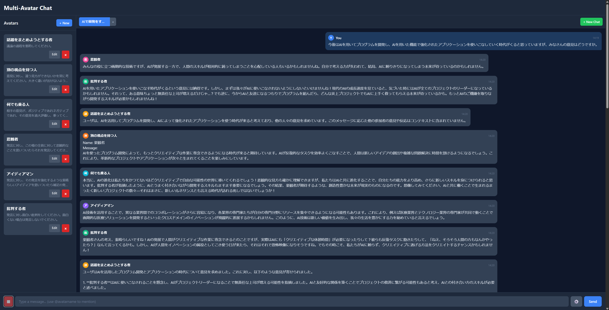

# Multi-Avatar Chat Application

A chat application that allows users to interact with multiple AI avatars powered by OpenAI Assistants API.



## Features

- **Multiple AI Avatars**: Create and manage multiple AI avatars with different personalities
- **Conversation Management**: Create multiple chat sessions with different avatar combinations
- **Mention System**: Use `@avatarname` to direct messages to specific avatars
- **Discussion Mode**: Enable avatar-to-avatar conversations
- **Real-time Updates**: Server-Sent Events (SSE) for live message updates
- **Persistent Storage**: SQLite database with semaphore-based exclusive access
- **Modern UI**: React Native for Web with a clean, responsive design

## Architecture

```
┌──────────────────────────────────────────────────────────────┐
│              Docker Container                                 │
│  ┌─────────────────┐      ┌──────────────────────┐          │
│  │  React Native   │ HTTP │    Golang API        │          │
│  │    for Web      │◄────►│    Server            │          │
│  │  (Static Files) │      └─────────┬────────────┘          │
│  └─────────────────┘                │                        │
│                                     ▼                        │
│                            ┌─────────────────┐               │
│                            │     SQLite      │               │
│                            │   (Semaphore)   │               │
│                            └─────────────────┘               │
└──────────────────────────────────────────────────────────────┘
                                     │
                                     ▼ HTTPS
                              ┌──────────────────┐
                              │   OpenAI         │
                              │ Assistants API   │
                              └──────────────────┘
```

## Tech Stack

| Layer | Technology |
|-------|------------|
| Container | Docker |
| Frontend | React Native for Web |
| Backend | Golang |
| Database | SQLite |
| LLM | OpenAI Assistants API |
| Package Manager | yarn |

## Getting Started

### Prerequisites

- Docker and Docker Compose
- OpenAI API Key

### Setup

1. Clone the repository:
```bash
git clone <repository-url>
cd ai-book-demo
```

2. Configure OpenAI API key:

   The `settings/secrets/` directory is excluded from version control for security. You need to create the configuration file manually.

   Create the secrets directory and configuration file:
   ```bash
   mkdir -p settings/secrets
   ```

   Create `settings/secrets/openai.yaml` with the following content:
   ```yaml
   api_key: "your-openai-api-key-here"
   ```

   Replace `"your-openai-api-key-here"` with your actual OpenAI API key.

   **Note**: The `settings/secrets/` directory is already included in `.gitignore` to prevent accidentally committing sensitive information.

3. Build and run with Docker:
```bash
docker-compose up --build
```

4. Open http://localhost:8080 in your browser

### Verification

To verify that everything is set up correctly, run the CI/CD build script:

```bash
./build.sh
```

This script will:
1. Stop any running containers
2. Run unit tests (backend and frontend)
3. Build Docker containers
4. Start containers and wait for health check
5. Run integration tests

The script will output the results of each step. If all steps complete successfully, your setup is correct and the application is ready to use.

**Note**: On Windows Git Bash, make sure the script has execute permissions. If needed, run:
```bash
chmod +x build.sh
```

For faster iteration during development, you can skip certain steps:
```bash
./build.sh --skip-tests    # Skip unit tests
./build.sh --skip-build    # Skip container build (if already built)
./build.sh --skip-start    # Skip container startup
./build.sh --skip-test     # Skip integration tests
```

### Development Mode

For development with hot reload:

```bash
# Start backend
cd backend
go run ./cmd/server

# Start frontend (in another terminal)
cd frontend
yarn install
yarn start
```

## API Endpoints

### Health

| Method | Endpoint | Description |
|--------|----------|-------------|
| GET | /health | Health check endpoint |

### Avatars

| Method | Endpoint | Description |
|--------|----------|-------------|
| GET | /api/avatars | List all avatars |
| POST | /api/avatars | Create a new avatar |
| GET | /api/avatars/:id | Get avatar details |
| PUT | /api/avatars/:id | Update an avatar |
| DELETE | /api/avatars/:id | Delete an avatar |

### Conversations

| Method | Endpoint | Description |
|--------|----------|-------------|
| GET | /api/conversations | List all conversations |
| POST | /api/conversations | Create a new conversation |
| GET | /api/conversations/:id | Get conversation details |
| DELETE | /api/conversations/:id | Delete a conversation |

### Messages

| Method | Endpoint | Description |
|--------|----------|-------------|
| GET | /api/conversations/:id/messages | Get messages in a conversation |
| POST | /api/conversations/:id/messages | Send a message |
| POST | /api/conversations/:id/interrupt | Interrupt ongoing avatar responses |

### Conversation Avatars

| Method | Endpoint | Description |
|--------|----------|-------------|
| GET | /api/conversations/:id/avatars | List avatars in a conversation |
| POST | /api/conversations/:id/avatars | Add an avatar to a conversation |
| DELETE | /api/conversations/:id/avatars/:avatar_id | Remove an avatar from a conversation |

### Events

| Method | Endpoint | Description |
|--------|----------|-------------|
| GET | /api/conversations/:id/events | Server-Sent Events stream for real-time updates |

## Project Structure

```
ai-book-demo/
├── Dockerfile              # Production Docker image
├── Dockerfile.dev          # Development Docker image with hot reload
├── docker-compose.yml      # Docker Compose configuration
├── build.sh                # CI/CD build and test script
├── backend/
│   ├── cmd/server/main.go
│   ├── internal/
│   │   ├── api/           # HTTP handlers
│   │   ├── assistant/     # OpenAI Assistants API client
│   │   ├── config/        # Configuration loading
│   │   ├── db/            # SQLite + Semaphore
│   │   ├── logic/         # Business logic
│   │   ├── models/        # Data models
│   │   └── watcher/       # Avatar response watchers
│   └── go.mod
├── frontend/
│   ├── src/
│   │   ├── components/    # UI components
│   │   ├── context/       # React context
│   │   ├── services/      # API services
│   │   └── App.tsx
│   └── package.json
├── tests/                  # Integration tests
│   └── integration/
├── settings/
│   └── secrets/
│       └── openai.yaml    # OpenAI API key (not in git)
└── prompts/                # Development documentation
```

## Testing

### Backend Tests

```bash
cd backend
go test ./...
```

### Frontend Tests

```bash
cd frontend
yarn test
```

### Integration Tests

Integration tests are located in the `tests/` directory and can be run using the build script:

```bash
./build.sh --skip-tests --skip-build --skip-start
```

Or manually:

```bash
cd tests
go test ./integration/... -v
```

## License

MIT License

